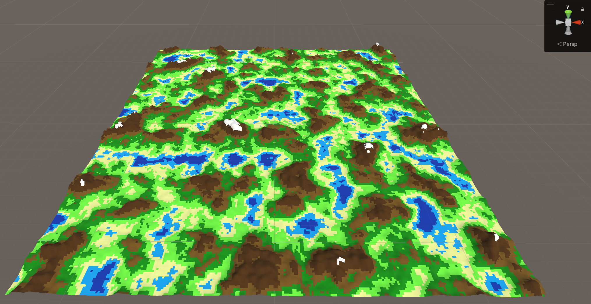

# Unity Open World Generator

This is a tool to help generate open worlds in Unity. It takes a number of parameters such as map size, inputs for noise and terrain types, and then it creates a world based on those parameters. This is a WIP and is pretty basic so far.

